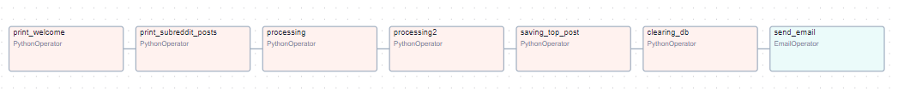
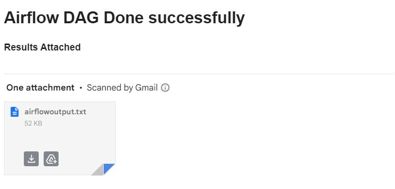
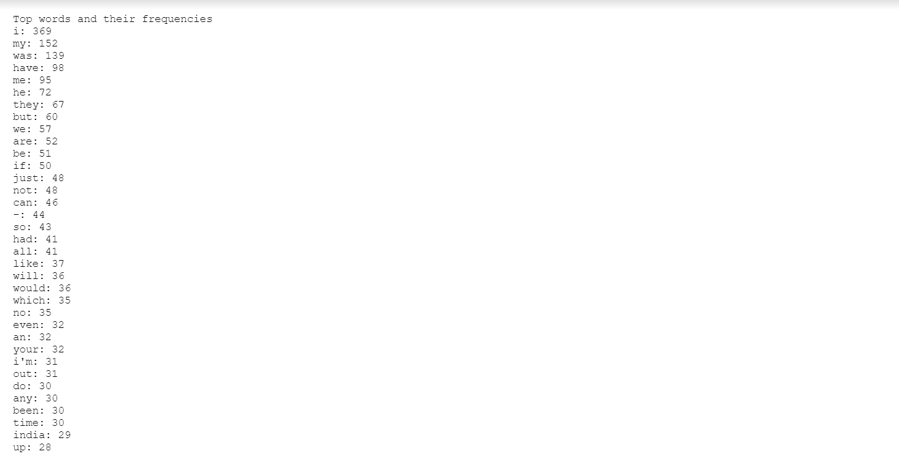
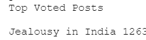

# Automatic Data Fetcher and analysis tool using Airflow:

This Program automates the prcoess of fetching and processing the data from r/india for data analysis purposes.

Tech Used: Airflow, Docker, MongoDB

## How it works:
    1. There is a welcome tasks which basically prints hello, this is just a dummy task, to check the working of the tasks.
    2. The scrape Task is called, which uses the api to scrape 100 posts from r/india. 100 daily i feel is a good number, but can be increased. The data is then stored in the mongoDB server, for easy access and sorting and runnnig queries for processing.
    3. Now, the 3rd task is to connect to the mongodb server in the internal server, and sorted to find the most upvoted post and it is stored in the mongodb server for later access.
    4. Now the word Count program runs and the word count for all words are counted, many stopwords are neglected to get more meaningful data.
    5. Now, we want to write the most upvoted post on the output file so we can send it as an email, the output file is stored on the docker container so it can be accessed and sent accross as an attachment in the email.
    6. We are done with the days tasks so we can clear all the old data in the database, so we dont store alot of data.
    7. Lastly, we just have to send the text file across as an attachment in the email.
    8. We are connected to SMTP server, specifically the gmail smtp server on port 587, for encrypted data transfer.
    9. The DAG is scheduled to run daily, so everyday it will repeat these tasks, without any trigger from us.

### IT IS ALSO IMPORTANT TO IMPORT PRAW AND PYMONGO ON THE DOCKER ITSELF TO NOT RUN INTO ERRORS:

The processes look like this, hence called DAGs

### FUTURE PLANS AND IDEAS AND DIFFICULTIES FACED:

1. I want to make a frontend program which basically allows users to subscribe to this service, but currently I am unable to find a way to send email to multiple people via input
2. NLTK package does not seem to work, it cannot download its resources in the docker enviornment and so i have to use brute force to calculate word count and also its hard to generate stop words.
3. MongoDB can be used in a better way, to optimize some queries
4. I want to add more analysis features like sentiment analysis, trends, user trends and etc.
5. Lastly, I feel like setting up my own SMTP server and send emails through that, by doing some research it came to my knowledge that I can host a SMTP server on my local device, but as of now i find it very tricky.

# OUTPUTS AND GENERAL OBSERVATIONS:

## OUTPUTS:

## OBSERVATIONS:

1. The data is not the cleanest and not bein able to use NLTK really hurts the value and consistency of data.
2. I want to add some security features, also hide all api keys and SMTP passwords properly (hence, the repo is private).
3. The program doesnt seem to be very slow, but again I want to optimize it how much ever i can.
4. Make better use of MongoDB and other tools provided by python is also something i want to look into

# WHY DID I CHOOSE TO DO THIS? WHAT ARE THE REAL LIFE USE CASES ?

**If made better and added alot more features can be a viable choice for data analysis, as of now not so much**

## USE CASE:
1. With sentiment analysis, a person can find the overall mood of india.
2. Word count helps find what is the most talked about thing, since the reddit posts are new, it gives us a good picture of the things talked about.
3. Top Upvoted post, shows us what people are intrested and analysis can be done to find why they are intrested also.
4. Alot more features can be added to increase its viability and uses, as of now its just an automated tool to send few analysis daily to the concerned people.

## WHY DID I CHOOSE TO DO THIS?
1. I want to work on the MERN stack, but i wanted to try this out, and try to see and implement my own daily digest kind of thing.
2. I wanted to test out airflow as i have seen it been used at my intership for data orchestration
3. Its something new and aroused alot of interest in me, great learning experience, as i got to learn about docker, SMTP servers, and airflow alot more

